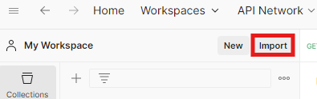
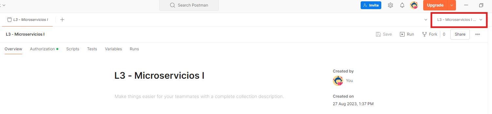
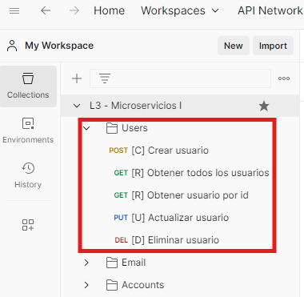

# Laboratorios 3 y 4 de Microservicios

## Antes de la sesión

### Instalaciones Obligatorias

- **Git**: Descargar desde [aquí](https://git-scm.com/downloads).

- **JDK 17**: Descargar desde [este enlace](https://docs.aws.amazon.com/corretto/latest/corretto-17-ug/downloads-list.html).

- **Postgres**: Descargar la versión 17.6 de [aquí](https://www.enterprisedb.com/downloads/postgres-postgresql-downloads) (Se deberá seleccionar una contraseña para el servidor, e.g. **postgres**. Esta contraseña es solo para pruebas locales).

- **Postman**: Descargar desde [este enlace](https://www.postman.com/downloads/).

### Instalaciones Opcionales

Cada estudiante es libre de utilizar el IDE y cliente de base de datos que prefiera, pero durante el laboratorio se usarán específicamente los siguientes softwares:

- **IntelliJ IDEA**: Descargar la edición Community desde [este enlace](https://www.jetbrains.com/idea/download/).

- **DBeaver**: Descargar la edición Community desde [aquí](https://dbeaver.io/download/).

### Pruebas de Postman

1. Clona este repositorio en tu máquina local.

2. Accede a la carpeta "Postman collection".

3. Dentro de esta carpeta, encontrarás un archivo con extensión .json. Este archivo contiene una colección exportada de Postman.

4. Importa la colección en Postman:
   - Abre Postman.
   - Haz clic en el botón "Import" en la esquina superior izquierda.
   - Selecciona el archivo L3 - Microservicios I.postman_collection.json de la carpeta "Postman collection".

5. Del mismo modo, importa el archivo de variables de ambiente (L3 - Microservicios I - ENV.postman_environment.json) y selecciónalo como ambiente en la parte superior derecha.

6. Explora la carpeta "Users" y verifica que puedes llamar a los distintos endpoints proporcionados.

## Durante la sesión

### Desarrollo del Microservicio de Cuentas (Accounts)

Durante la sesión de laboratorio, trabajaremos en la creación de un microservicio en Java y Spring como parte de una arquitectura de microservicios.
